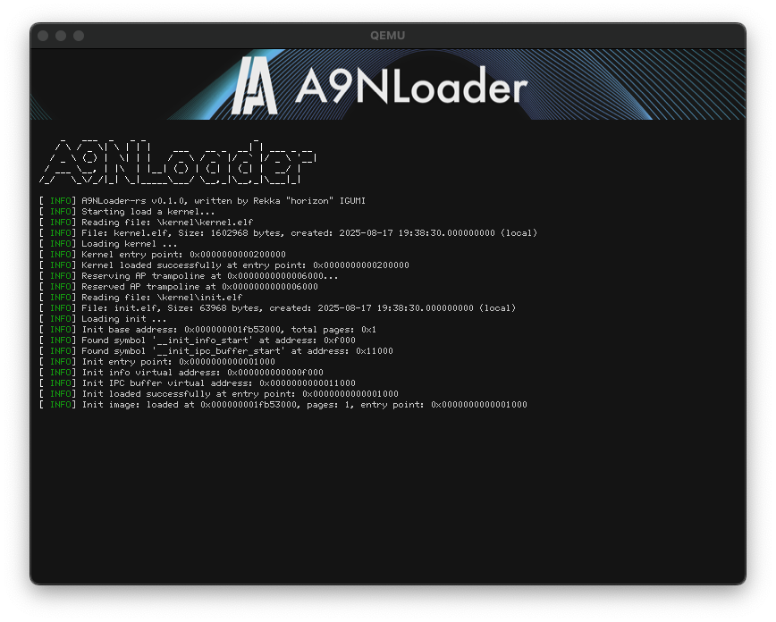

# A9NLoader-rs



A9NLoader-rs is a bootloader written entirely in Rust that satisfies the A9N Boot Protocol (x86_64) for the A9N Microkernel.
It's a complete rewrite of the original A9NLoader(C w/EDK2).

## Features

- **All in Rust**: The entire bootloader is written in Rust, leveraging the language's safety and modern features.
- **A9N Boot Protocol (x86_64)**: It correctly loads the kernel and initial executable files according to the A9N Boot Protocol, preparing the system to run.

## Build
```bash
cargo build --release
```
## Run with QEMU (for testing)

To run the bootloader in the QEMU emulator, you will need to provide two executable files: kernel.elf and init.elf.

- 1. Place your `kernel.elf` and `init.elf` files in the root directory of the project.
- 1. Run the following command:
```bash
cargo run
```

## LICENSE

[MIT License](https://choosealicense.com/licenses/mit/)
